# UrgentApp

Aplicación móvil desarrollada en Flutter para la gestión de hospitales, pacientes y atención de emergencias. El sistema implementa tres roles de usuario (Administrador, Médico y Traslado), permitiendo administrar hospitales, habitaciones, pacientes y atenciones médicas mediante Firebase.

---

## Descripción

UrgentApp es una aplicación móvil diseñada para optimizar la gestión de hospitales y la atención de emergencias. El sistema permite registrar usuarios, administrar hospitales y habitaciones, gestionar pacientes y registrar atenciones médicas de acuerdo con el rol asignado.

El proyecto fue desarrollado como parte de la formación académica en Ingeniería en Sistemas Computacionales, aplicando buenas prácticas de desarrollo móvil, arquitectura limpia y bases de datos en la nube.

---

## Tecnologías utilizadas

- Flutter
- Dart
- Firebase Authentication
- Cloud Firestore
- Firebase Storage
- Material Design
- Clean Architecture

---

## Arquitectura

El proyecto sigue una estructura basada en Clean Architecture para mantener una adecuada separación de responsabilidades.

```text
lib/
│
├── core/
├── data/
├── domain/
├── presentation/
│
├── main.dart
└── firebase_options.dart
```

---

## Funcionalidades

### Administrador

- Inicio de sesión.
- Registro de usuarios.
- Panel general con estadísticas.
- Gestión de hospitales.
- Gestión de habitaciones.
- Cambio de estado de habitaciones.
- Registro de pacientes.
- Consulta del historial del paciente.
- Gestión de emergencias.
- Administración del perfil.

### Médico

- Consulta de pacientes.
- Consulta de emergencias.
- Registro de atenciones médicas.
- Edición de atenciones.
- Consulta del historial clínico.
- Administración del perfil.

### Traslado

- Consulta de hospitales disponibles.
- Recomendación de hospital según la emergencia.
- Registro de pacientes.
- Consulta del detalle del hospital.
- Administración del perfil.

---

## Capturas de pantalla

### Inicio de sesión

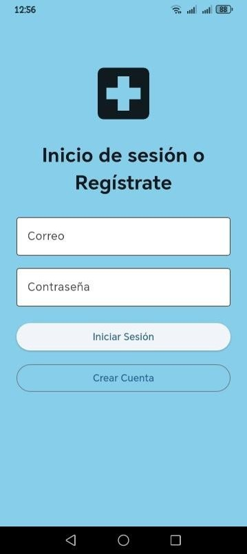

---

### Registro de usuarios

| Administrador | Médico | Traslado |
|--------------|---------|----------|
| 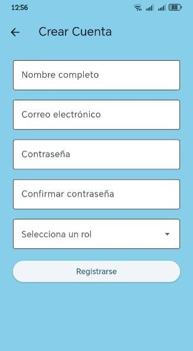 | 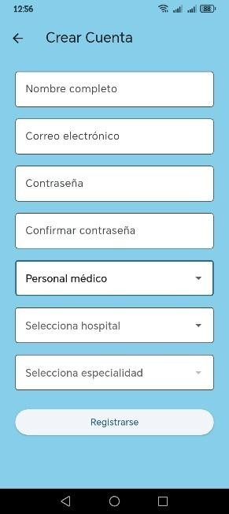 | 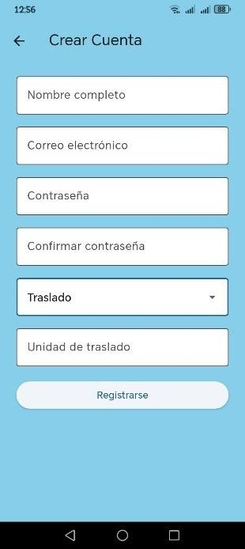 |

---

### Panel principal

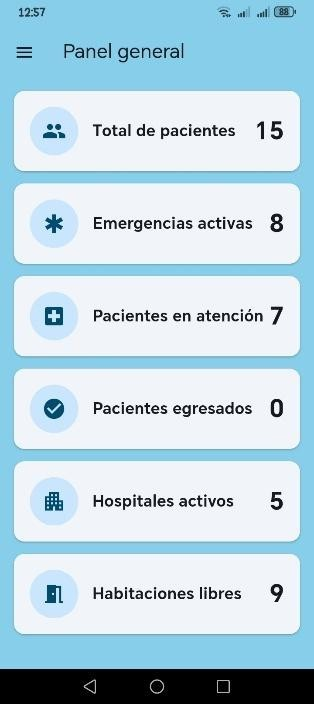

---

### Gestión de hospitales

| Hospitales | Detalle |
|------------|---------|
|  |  |

---

### Gestión de habitaciones

| Habitaciones | Cambio de estado |
|--------------|------------------|
| 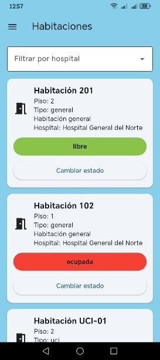 | 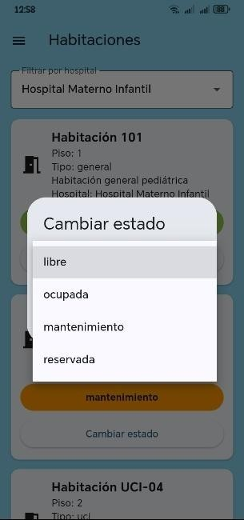 |

---

### Gestión de pacientes

| Pacientes | Historial |
|------------|-----------|
| 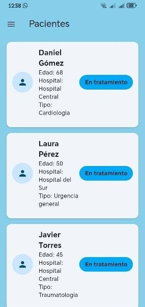 | 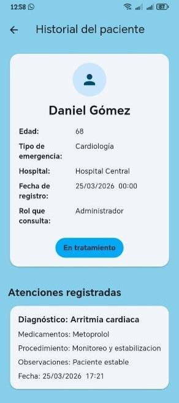 |

---

### Atención médica

| Registrar atención | Editar atención |
|--------------------|-----------------|
|  | 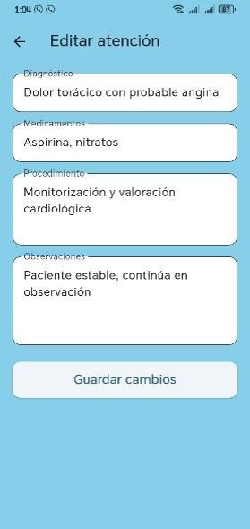 |

---

### Perfil de usuarios

| Administrador | Médico | Traslado |
|--------------|---------|----------|
| 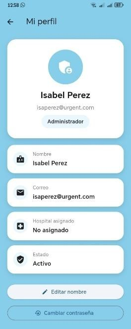 | 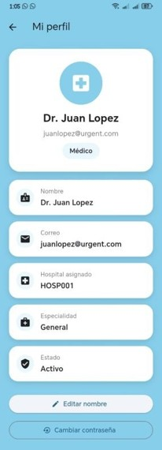 |  |

---

## Instalación

Clonar el repositorio.

```bash
git clone https://github.com/isaperez03/UrgentApp.git
```

Entrar al proyecto.

```bash
cd UrgentApp
```

Instalar dependencias.

```bash
flutter pub get
```

Agregar la configuración de Firebase.

El archivo:

```
android/app/google-services.json
```

no se incluye en este repositorio por motivos de seguridad. Es necesario crear un proyecto en Firebase y agregar el archivo correspondiente antes de ejecutar la aplicación.

Ejecutar el proyecto.

```bash
flutter run
```

---

## Estado del proyecto

Proyecto desarrollado con fines académicos para demostrar conocimientos en desarrollo móvil, Flutter, Firebase y arquitectura limpia.

---

## Autora

**Juana Isabel Perez Lopez**

Ingeniería en Sistemas Computacionales

Instituto Tecnológico Superior de Misantla

GitHub:

https://github.com/isaperez03
